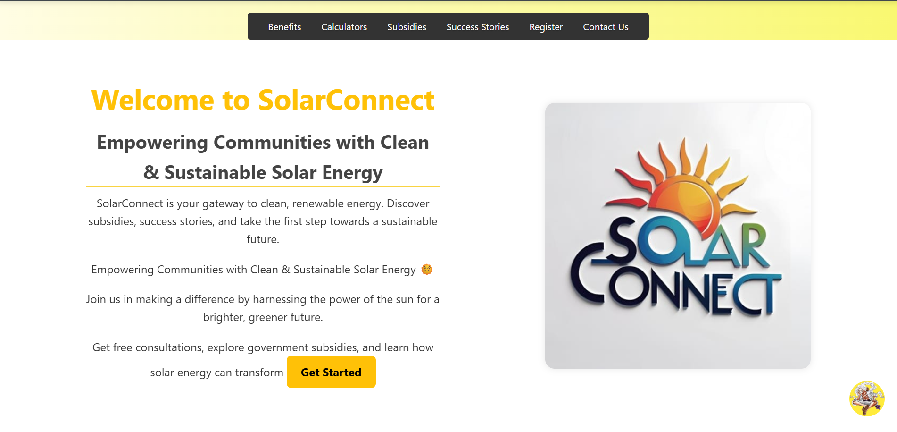
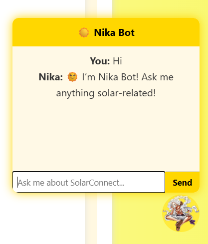
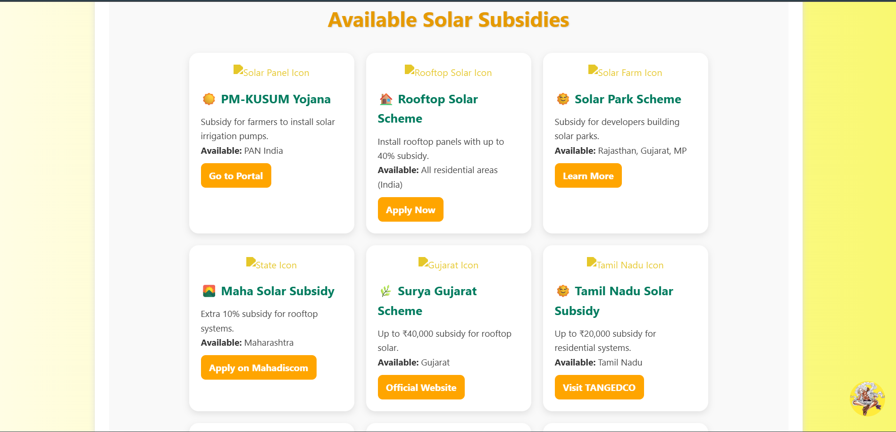
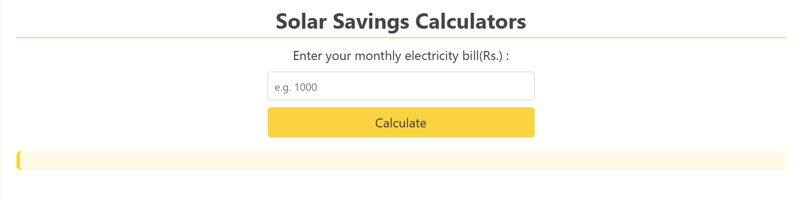

# ☀️ SolarConnect

**SolarConnect** is a community engagement project built to **spread awareness about solar energy**, promote **government schemes**, share **success stories**, and help users **register for free solar consultations** — empowering communities to move toward sustainable energy adoption.

🌐 **Live Website:** [SolarConnect](https://himanshu-jadhav108.github.io/SolarConnect/)

---

## 🌍 Project Overview

SolarConnect bridges the gap between *citizens and clean energy adoption*.  
The platform provides:
- ✅ Easy understanding of **solar energy benefits**
- 💰 Information on **government subsidies & schemes**
- 🏆 **Success stories** of real solar adopters
- 🧾 A quick **registration form** for free solar consultation

The project was created as part of a **Community Engagement Initiative** to encourage sustainability and responsible energy choices.

---

## 🧩 Features

| Feature | Description |
|----------|--------------|
| 💡 **Awareness Section** | Explains the importance and advantages of solar energy. |
| 🏛️ **Government Schemes** | Lists current solar subsidy programs and adoption incentives. |
| 🌞 **Success Stories** | Inspiring examples of households and communities using solar. |
| 📋 **Consultation Form** | Allows users to register for free guidance and documentation help. |
| 📧 **Email Integration** | Uses EmailJS to directly send registration details to the admin. |
| 📱 **Responsive Design** | Works smoothly on both mobile and desktop devices. |

---

## 🛠️ Tech Stack

| Layer | Technologies |
|-------|---------------|
| **Frontend** | HTML5, CSS3, JavaScript |
| **Email Handling** | [EmailJS](https://www.emailjs.com/) |
| **Hosting** | GitHub Pages |
| **Design** | Clean, minimal UI with a solar-themed color palette |

---

## ⚙️ EmailJS Integration

The registration form uses **EmailJS** to send user details directly to the admin’s inbox — no backend required.

**Setup Steps:**
1. Create an account at [EmailJS.com](https://www.emailjs.com/).  
2. Connect your email service (e.g., Gmail).  
3. Create an email template with placeholders for:
   ```
   {{full_name}}, {{income}}, {{city}}, {{state}}, {{phone}}, {{email}}, {{project}}
   ```
4. Copy your:
   - `SERVICE_ID`
   - `TEMPLATE_ID`
   - `PUBLIC_KEY`
5. Add them to your `script.js` file:
   ```js
   emailjs.init("YOUR_PUBLIC_KEY");
   emailjs.sendForm("YOUR_SERVICE_ID", "YOUR_TEMPLATE_ID", form);
   ```

---

## 📂 Folder Structure

```
SolarConnect/
│
├── index.html          # Main webpage
├── styles.css          # Stylesheet
├── script.js           # JavaScript + EmailJS integration
├── chatbot.js          # Chatbot Logic
├── images/             # Images, icons, and media
└── README.md           # Project documentation
```

---

## 📸 Screenshots

### 🖥️ Website Preview


### Registration Form 
![SolarConnect Registartion Form Screenshot]

### Nika ChatBot


### Subsidy Section


### Solar Calculator 



---

## 🚀 Future Enhancements

- 🔹 Add user dashboard for consultation tracking  
- 🔹 Include solar energy calculators (ROI, panel size, etc.)  
- 🔹 Expand database integration for form submissions  
- 🔹 Add regional language support (Marathi / Hindi)

---

## 👨‍💻 Author

**Himanshu Jadhav**  
Second-Year Engineering Student (AI & Data Science)  
[GitHub](https://github.com/himanshu-jadhav108) • [LinkedIn](https://www.linkedin.com/in/himanshu-jadhav-328082339?utm_source=share&utm_campaign=share_via&utm_content=profile&utm_medium=android_app ) • [Instagram](https://www.instagram.com/himanshu_jadhav_108?igsh=MWYxamppcTBlY3Rl ) • [Portfolio](https://himanshu-jadhav-portfolio.vercel.app/)

---

## 🧠 Project Purpose

> “SolarConnect is more than a website — it’s a step toward a sustainable and self-reliant India.”  
> Developed as part of a **Community Engagement Project** under **Savitribai Phule Pune University**.

---

## 🪪 License

This project is open-source and free to use under the [MIT License](LICENSE).

---

### ⭐ If you like this project, don’t forget to star the repo!
